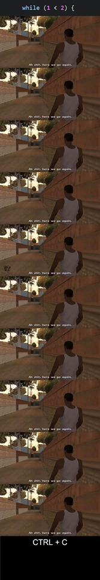

# Tutorial 3 Notes

## More notes at https://cgi.cse.unsw.edu.au/~cs1511/20T1/tut/03/questions

## Any questions from the lectures/past tute?

## Q2) Are these good and valid C variable names?

<details>
<summary>THX1138</summary>

### Not descriptive and either snake_case or camelCase but valid
</details>

<details>
<summary>2for1</summary>

### Possibly good but not valid as it starts with a number.
</details>

<details>
<summary>keanuReeves</summary>

### Good if the variable stores something to do with Keanu Reeves (also example of camelCase) and valid.
</details>

<details>
<summary>mr_bean</summary>

### Good if the variable stores something to do with Mr Bean (also example of snake_case) and valid.
</details>

<details>
<summary>i</summary>

### Good for a simple incrementer in a while loop but try and use a contextual variable e.g. if you have an array of all primes call the counter primeIndex or currentPrime.
</details>

<details>
<summary>NUM_PEARS</summary>

### Does not follow snake_case or camelCase this is in fact SHOUTY SNAKE_CASE - generally used for #defines.
</details>

<details>
<summary>my space</summary>

### Good if variable has something to do with My Space but not valid as it contains a space.
</details>

<details>
<summary>Event_counter</summary>

### Starts with capital so not really good style
</details>

<details>
<summary>^oo^</summary>

### Not descriptive and not valid as ^ cannot occur anywhere in a variable name.
</details>

<details>
<summary>_MEMLIMIT</summary>

### Does not adhere to a naming convention for variables (snake_case or camelCase) partially valid, the complier will allow it but it may override a system variable called _MEMLIMIT.
</details>

<details>
<summary>return</summary>

### Not valid as return is a keyword along with many others we have seen e.g. void, if, and more.
</details>

<details>
<summary>*numApples</summary>

### Trick question: Syntactically correct but sematically incorrect (c will accept it but it does not do what we expect, it creates a pointer).
</details>

## Q1) Code Review

* The reviewees show their code on the projector, and briefly walk through how it works.
* The class and tutor (the reviewers) give feedback, ask questions, make suggestions. You tutor will show you how to do this at first but then will expect the other reviewers to take over.
* Reviewers are NOT negative, a review is to be supportive and constructive and helpful to the reviewees.
* The reviewees should speak very little, just give a brief overview of the code they want reviewed.
* Let everyone have a turn to speak, don’t dominate the conversation.
* Contribute and participate, don’t be silent. If you don’t understand anything then that doesn’t mean be silent - it means ASK for an explanation. By asking you are helping the coders to see how to be clearer.

## Where/What is the style guide?

## Q3) C is a typed language. What does this mean? What is the type of truth/false?

<details>
<summary>Answer</summary>

It means each variable has an associated type and thus size. Different operations work on different types.

For example int, double (dont use ~~float~~), boolean??, ~~string~~, ~~char~~, ~~pointer~~, ~~array~~, ~~struct~~. We will cover most of these types in the future, one quick and important question though is:

What values are true and false? How could we test this?

</details>

## The humble while loop

```c
    initialise counter;
    while (condition) {
        code;
        increment/change counter;
    }
```

For example:

```c
    i = 1;
    while (i < 2) {
        printf("Ah shit, here we go again.");
    }
```
<details>
<summary> Answer </summary>


</details>

```c
    i = 5;
    while (i > 0) {
        printf("%d\n", i);
        i--;
    }
```
<details>
<summary> Answer </summary>

```c
    5
    4
    3
    2
    1
```
</details>

```c
    i = 5;
    while (i > 0) {
        i--;
        printf("%d\n", i);
    }
```
<details>
<summary> Answer </summary>

```c
    4
    3
    2
    1
    0
```
</details>

```c
    i = 0;
    while (i <= 10) {
        printf("%d\n", i);
        i += 2;
    }
```
<details>
<summary> Answer </summary>

```c
    0
    2
    4
    6
    8
    10
```
</details>

## Q4) count42.c

Print the integers 1..42, one per line. 

For example:

```c
    $ ./count42
    1
    2
    ...
    42
```

## Q5) count_up.c 

Reads an integer **n** and then print the integers 1..**n**, one per line. 

For example:

```c
    $ ./count_up
    Enter finish: 3
    1
    2
    3
    $ ./count_up
    Enter finish: 7
    1
    2
    3
    4
    5
    6
    7
```

## Q6) range.c 

Write a C program range.c which reads integers **n** and **m** and then print the integers **n**..**m**, one per line.

For example:

```c
    $ ./range
    Enter start: 3
    Enter finish: 7
    3
    4
    5
    6
    7
```
## Q7) Discuss the errors in these while loops 

```c
int i;

while (i < 100) {
    printf("%d\n", i);
    i = i + 1;
}
```

<details>
<summary>
Answer
</summary>

```i``` is not initialised so it will take on the value that is already in memory. To fix this initialise ```i```.

</details>

```c
int i = 0;
int j = 0;

while (j = 1 || i < 100) {
    printf("%d\n", i);
    i = i + 1;
}
```

<details>
<summary>
Answer
</summary>

```j``` is never changed. This is a code smell and indicates something is wrong with the code.

</details>

```c
int i = 0;
int n = 10;
while (i < n) {
    printf("%d\n", i);
    n = n + i;
    i = i + 1;
}
```

<details>
<summary>
Answer
</summary>

```n``` grows at a much faster rate than ```i``` meaning that the condition that ```i < n``` will always be true. 

</details>

```c
int i = 0;
while (i < 10)
    printf("%d\n", i);
    i = i + 1;
```

<details>
<summary>
Answer
</summary>

This involves a shorthand for while loops. When curly brackets are omitted the direct next line after the while condition is only run. Therefore this loop will always print 0. To fix it add back in curly brackets.

</details>

## Q8) range_7.c

Read 2 integers **n** and **m**, and then print the integers between **n** and **m** (including **n** and **m**) which are divisible by 7.

Hint: if x is divisible by 7, then x % 7 == 0

For example:

```c
    $ ./range7
    Enter start: 3
    Enter finish: 49
    7
    14
    21
    28
    35
    42
    49
```

# Bonus/revision/old questions

## range_divisible.c

Read 3 integers **n**, **m** and **x** then print the integers between **n** and **m** (including **n** and **m**) which are divisible by **x**.

```c
    $ ./range_divisible
    Enter start: 20
    Enter finish: 100
    Enter divisor: 13
    26
    39
    52
    65
    78
    91
    $ ./range_divisible
    Enter start: 80
    Enter finish: 120
    Enter divisor: 5
    80
    85
    90
    95
    100
    105
    110
    115
    120
```

## cm2feet.c

Read a height in centimetres and prints it in feet.

Reminder: there 2.54 centimetres in an inch and 12 inches in a foot.

For example:

```c
    $ ./cm2feet
    Enter your height in centimetres: 183
    Your height in feet is 6
```