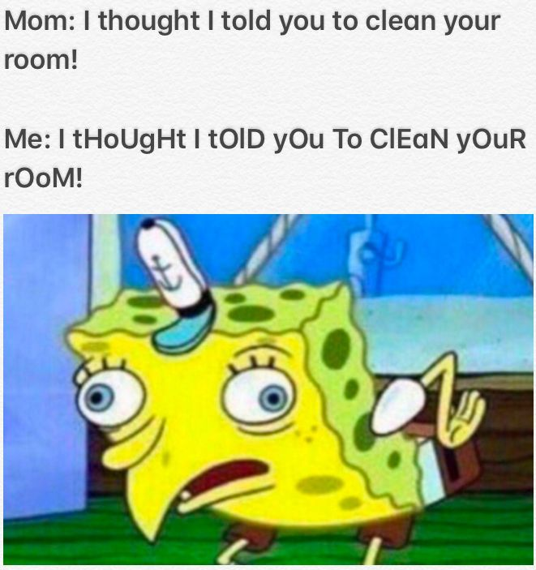

# Tutorial 7 Notes

## More notes at https://cgi.cse.unsw.edu.au/~cs1511/20T1/tut/07/questions

## Noteworthy points

* Pass/Fail Transition
* Today we will cover characters and strings + more input/output

## assignment 1

Well done everyone for such a great effort in the first assignment.

Take a moment to think about how you found the assignment, and what you learned in the process of working on it.

If you could go back in time to the very start of the assignment, and give one piece of advice to your past self, what would you say?

Your tutor will talk about how you will get feedback from the marking of assignment 1.

## What is a character?

So far in this course we have learnt about two data types - int and double. What about a char variable? What is the size of this variable, and what possible values can it have? What do these values mean?

## is_upper.c

Write a function with prototype `int isUpper(char ch)` that returns true if the character given is upper case and false otherwise.

## filter_upper.c

Write a program that removes all upper case letters from input and prints it out. Use is_upper.c and `getchar()` and `putchar()`

<details>
<summary>
Answer
</summary>

use `putchar()` and `getchar()`

</details>    

## What is a string?

<details>
<summary>
Answer
</summary>

An array of characters with a `\0` at the end to signify the finish.

</details>  

## Q4) What does this code do?

```c
int secret_function(char *word) {
    int i = 0;
    int result = 0;
    while (word[i] != '\0') {
        if(word[i] >= 'a' && word[i] <= 'z') {
            result++;
        }
        i++;
    }
    return result;
}
```

What does the char *word input mean? What's the relationship between an array and a pointer?

## spongebobify.c

Write a program that reads in a string from the user and spongebobifies it. hint: use fgets() . 



## What is a struct? What are the differences between structs and arrays?


